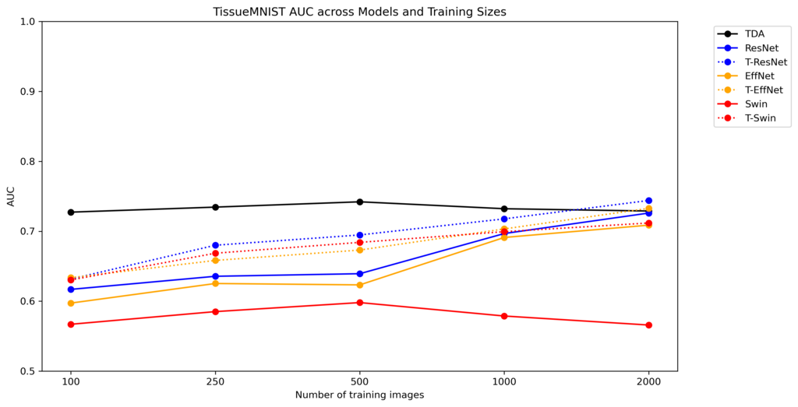

# TopoNet

This repository contains the codebase for the paper **"Enhancing Medical Imaging with Topological Methods in Limited-Data Settings"**.

This project explores the application of topological methods to enhance medical imaging, particularly in limited data scenarios. 
Our approach leverages topological data analysis (TDA) to improve the robustness and accuracy of medical image classification models. Please refer to our paper for more details on the project and the methodology followed.

## Table of Contents

- [TopoNet](#toponet)
  - [Table of Contents](#table-of-contents)
  - [Installation](#installation)
  - [Usage](#usage)
  - [Data](#data)
  - [Results and Figures](#results-and-figures)
    - [AUC Figures - 2D Datasets](#auc-figures---2d-datasets)
    - [AUC Figures - 3D Datasets](#auc-figures---3d-datasets)
    - [Example Filtration](#example-filtration)
  - [Acknowledgements](#acknowledgements)

## Installation

To get started, clone this repository and install the required dependencies.

Please see [environment.yml](./environment.yml) for all package requirements.

`torch >= 2.0` is required and we have tested the method with pytorch `2.3.0`. 

## Usage

Refer to the [config](./config/) folder for run configurations and [train.py](./train.py) for running experiments. Refer to the [Pytorch Lightning Trainer](./phm/trainers/cls_trainer.py) for multiclass/multilabel related configuration parameters.

See [phm/data/medmnist2d.py](./phm/data/medmnist2d.py) for limited data and Betti number input related config arguments. Betti numbers should be 
provided in csv format with aux network input channels modified to the total number of Betti numbers used per input image.

To train the model (as an example `PneumoniaMNIST` limited to 100 training images with resnet-50 backbone, with and without Betti Numbers), you can use the following commands:

```bash
python -u train.py --config config/r50-medmnist.yaml --train --gpu 0 data.dataset=pneumoniamnist data.train_data_num=100

python -u train.py --config config/r50-medmnist-concat.yaml --train --gpu 0 data.dataset=pneumoniamnist data.train_data_num=100
```

You can refer to the same training file for evaluating the checkpoints of a trained model.

## Data

The dataset used in this project is not included in the repository.
You can download the dataset from [MedMNIST](https://medmnist.com). 
The project is configured to automatically download the dataset given that a valid path for `data.dataroot` is provided in the corresponding configuration file.

## Results and Figures

The results of our experiments are documented in the paper. Briefly, the topological methods showed improvements in performance over the baseline models in limited-data settings.

### AUC Figures - 2D Datasets

The following figures demonstrate the ROCAUC score comparisons of different models for the 2D MedMNIST datasets:

 

 

 

### AUC Figures - 3D Datasets

The following figures demonstrate the ROCAUC score comparisons of different models for the 3D MedMNIST datasets:


### Example Filtration

The following animation and image is an example of a filtration over one of the input images.


## Acknowledgements

- [https://github.com/MedMNIST/experiments](https://github.com/MedMNIST/experiments) for original MedMnist experiments, [https://github.com/MedMNIST/MedMNIST](https://github.com/MedMNIST/MedMNIST) for datasets
- [https://github.com/threestudio-project/threestudio](https://github.com/threestudio-project/threestudio) for the codebase structure
